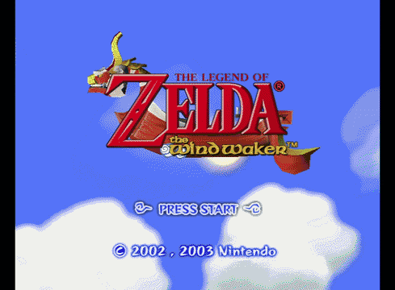
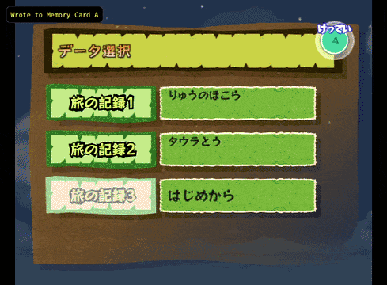

# TWW Demo Timer Disable & Save Restoration

This assembles a Gecko code that both disables the timer in demo version
of TWW and restores saving and the associated menus in the USA, JP, and PAL
versions of The Legend of Zelda: Collector's Edition.

## What is Restored

- Saving from Quest Status and Item Select
- Opening Options from Quest Status
- File selection, including:
  - "New Game" working
  - "Copy" and "Erase" on save slots working
- Memcard detection and handling
- New memcard files keep the original _Dungeon_, _Stealth_, and _Island_ savedata

Additionally, the demo normally overwrites your names with "Link" so you lose the
original demo filename if you save. This skips that, at the side-effect of being
called the demo filename now in-game. If this is undesirable, you can remove/comment
out that portion of the assembly and re-build the project.

## Building

Build using the included assembler and objcopy:

```powershell
.\build.bat
```

This builds all three codes in `.\build`. Use the one for your preferred region:

| Region | Game ID  |             File              |
| ------ | -------- | ----------------------------- |
| USA    | `PZLE01` | `restore-menus-usa.gecko.txt` |
| JP     | `PZLJ01` | `restore-menus-jp.gecko.txt`  |
| PAL    | `PZLP01` | `restore-menus-pal.gecko.txt` |

The codes can also be found at the [bottom of this readme](#gecko-codes).

## How It Works

The C0 code stays loaded while Collector's Edition switches games. It checks for
the launcher from its code, skips the instruction that sets the demo timer, and
then waits for the demo to load before installing the menu/memcard hooks.

The hooks reuse menu code and resources already present in the demo, with
missing behavior restored from the retail versions. If the `DEMO_SAVE_READY_HOOK` hook
disappears after a reset, the code waits for the launcher/demo to load again.

Each time file select is opened, the game's `ShopDemoDataLoad`/`ShopDemoDataSet`
sequence loads the presets before the memcard checks. Creating a new memcard save
copies all three slots and then uses the game's existing card write functionality.

## Interesting Version Differences

The JP demo actually has working file slot labels already, including JP text,
so we don't need to add any extra code for that when compiling for it.

PAL's `setSaveData` uses different registers than USA, so the file slot composition
code uses assembler variables for this specific hook:

|     Alias     |  USA  |  PAL  |
| ------------- | ----- | ----- |
| `file_offset` | `r26` | `r25` |
| `file_menu`   | `r27` | `r26` |
| `file_pane`   | `r28` | `r27` |
| `file_data`   | `r29` | `r28` |
| `file_slot`   | `r30` | `r29` |

## GIFs

### Prompt to make new memory card save data


The defaults populate before making the save file; the defaults are saved to your card.

### Copy and Erase


They are functional despite being greyed out.

### Saving the Game


Saving the game works from both Quest Status and Item Select.

### JP/PAL Support


PAL and JP are supported as well. This .gif is making a new file in the JP Demo, where then the intro starts to play.

## Relevant Files

```text
lozce_persistent.asm .. bootstrapper/hook installation
restore_menus.asm ..... menu/memcard patches
regions/*.inc ......... regional addresses/menu layouts
build.bat ............. runs build.ps1
build.ps1 ............. assembles and writes all three Gecko codes
restore-saving.txt .... original saving code and restoration notes
```

## Credits

- [SuperDude88](https://github.com/SuperDude88)'s original restoration code he provided to me
- My subsequent notes in [restore-saving.txt](restore-saving.txt), a bit outdated now though compared to the current codebase
- [TWW decomp](https://github.com/zeldaret/tww) (ref for the menu and memcard code)
- [SimplySnaps](https://www.youtube.com/@SimplySnaps) for her exploration into this demo in the first place

## Gecko Codes

<details>
<summary><b>USA</b> (PZLE01)</summary>

```asm
$Timer Disable/Menu Restoration [Savestate, SuperDude88]
C0000000 000000EF
4800045C 28000006
40820030 38000004
981F27EE 807F2780
3D80801D 618C4888
7D8903A6 4E800421
3D80801A 618C4F48
7D8903A6 4E800420
28000007 40820030
38000003 981F27EE
807F2784 3D80801D
618C5880 7D8903A6
4E800421 3D80801A
618C4F48 7D8903A6
4E800420 3D80801A
618C4F0C 7D8903A6
4E800420 40820030
38000001 981F23FE
807F2330 3D80801D
618C5880 7D8903A6
4E800421 3D80801C
618CF67C 7D8903A6
4E800420 3D80801C
618CEE6C 7D8903A6
4E800420 A87F0008
2C03000D 3860000E
38000004 4082000C
3860000A 38000003
987F0554 981F0557
3D808022 618CB9BC
7D8903A6 4E800420
38A40008 48000355
7C6802A6 90A3000C
387F0560 3D808022
618CD948 7D8903A6
4E800420 38000000
981F0554 981F0556
981F0557 3D808022
618CD984 7D8903A6
4E800420 387F0560
4800002D 3D808022
618CCA50 7D8903A6
4E800420 387F0554
48000015 3D80801D
618C7A9C 7D8903A6
4E800420 7C0802A6
480002E1 7C8802A6
8084000C 38A01650
7C0803A6 3D808000
618C3490 7D8903A6
4E800420 9421FFE0
7C0802A6 90010024
93E1001C 7C7F1B78
3C80803A 608417E0
80040000 2C000000
41820010 38800003
38A00005 48000094
38800000 3D808001
618C9298 7D8903A6
4E800421 2803000E
418200CC 38600000
480000D9 2C030000
41820030 7FE3FB78
38800000 3D808001
618C9298 7D8903A6
4E800421 28030000
40820010 38800000
38A00004 4800003C
38600000 4800009D
2C030000 40820080
7FE3FB78 38800000
3D808001 618C9298
7D8903A6 4E800421
28030000 41820060
38800001 38A00005
90810008 90A1000C
387F1664 3D808030
618C19C0 7D8903A6
4E800421 80810008
80A1000C 989F165A
90BF165C 387F1664
3D808030 618C1A9C
7D8903A6 4E800421
387F167C 3D808030
618C1D84 7D8903A6
4E800421 83E1001C
80010024 7C0803A6
38210020 4E800020
3C808000 880430E3
70000080 4182000C
38600000 4E800020
3D808030 618C5F68
7D8903A6 4E800420
887F3922 7C7F1A14
88033914 28000000
41820018 881F3928
3D808018 618C2654
7D8903A6 4E800420
3D808018 618C266C
7D8903A6 4E800420
887F3922 7C7F1A14
88033914 28000000
41820018 881F3928
3D808018 618C26D8
7D8903A6 4E800420
3D808018 618C26F0
7D8903A6 4E800420
881D0157 28000000
4082004C 7F83E378
3D808018 618CB6D4
7D8903A6 4E800420
48000011 4E657720
47616D65 00000000
7C8802A6 7C7BD214
806338F4 3D808032
618C9788 7D8903A6
4E800421 38000001
48000024 7C7BD214
806338F4 389D0157
3D808032 618C9788
7D8903A6 4E800421
38000000 7C7BF214
98033914 38000000
98033917 3D808018
618CB890 7D8903A6
4E800420 4E800021
801A4EFC FFFFFC1C
801CEE68 FFFFFC94
8022B9AC FFFFFCD4
8022D944 FFFFFD08
8022D974 FFFFFD2C
8022C9F0 FFFFFD4C
801D7A3C FFFFFD64
80018ED0 FFFFFDA4
8018B6D0 FFFFFF68
8018B76C FFFFFF88
80182650 FFFFFEF8
801826D4 FFFFFF30
4E800021 00000000
00000000 00000000
00000000 9421FF00
9001008C 90410090
BC610008 7C600026
9061007C 7C6802A6
90610080 7C6902A6
90610084 7C6102A6
90610088 4BFFFFBD
7E8802A6 3EA05457
62B55721 82D40000
7C16A840 41820008
48000180 83D40004
2C1E0000 41820030
2C1E0001 41820050
2C1E0002 41820074
2C1E0003 418200C4
2C1E0004 41820120
2C1E0005 41820128
48000168 4BFFFF01
7C8802A6 3884FD2C
3C608022 6063D974
48000225 90740008
38600001 90740004
48000140 3EA08003
62B52B28 82D50000
3EE08804 62F730E3
7C16B800 41820008
48000120 38600002
90740004 48000114
3EA08003 62B52B2C
82D50000 3EE05400
62F70632 7C16B800
41820018 3EE04800
62F70014 7C16B800
41820014 48000118
3EE04800 62F70014
92F50000 3C608003
60632B2C 38800004
480001BD 38600003
90740004 480000BC
3EA08003 62B52B28
82D50000 3EE08804
62F730E3 7C16B800
40820024 3EA08003
62B52B2C 82D50000
3EE04800 62F70014
7C16B800 4082FF68
48000080 3EA0802B
62B5A8D0 82D50000
3EE02805 62F70000
7C16B800 40820064
38600004 90740004
48000058 4800009D
38600005 90740004
48000048 3EA08022
62B5D974 82D50000
82F40008 7C16B800
4182FEF4 38600003
90740004 48000024
39400000 91540000
91540004 91540008
3D405457 614A5721
91540000 48000004
8061007C 7C6FF120
80610080 7C6803A6
80610084 7C6903A6
80610088 7C6103A6
8001008C 80410090
B8610008 38210100
4E800020 4BFFFDCD
7E8802A6 39400000
91540000 4BFFFFBC
9421FFE0 7C0802A6
90010024 93A10014
93C10018 93E1001C
4BFFFD3D 7FE802A6
7FFDFB78 3BC0000C
807D0000 809D0004
7C84FA14 48000059
809D0000 90640000
7C832378 38800004
48000065 3BBD0008
37DEFFFF 4082FFD4
3C608022 6063D360
3C806000 90830000
38800004 48000041
83A10014 83C10018
83E1001C 80010024
7C0803A6 38210020
4E800020 7CC32050
3CE003FF 60E7FFFC
7CC63838 3CE04800
60E70000 7CE33378
4E800020 7CA32214
54660034 7C00306C
38C60020 7C062840
4180FFF4 7C0004AC
54660034 7C0037AC
38C60020 7C062840
4180FFF4 7C0004AC
4C00012C 4E800020
*Collector's Edition USA (PZLE01).
*Disables the timer, and restores the menus/saving in the TWW demo.
*The project can be found at:
*https://github.com/Savestate2A03/loz-ce-ww-demo-gecko-bootstrapper
```

</details>

<details>
<summary><b>JP</b> (PZLJ01)</summary>

```asm
$Timer Disable/Menu Restoration [Savestate, SuperDude88]
C0000000 000000DB
480003B8 28000006
40820030 38000004
981F27EE 807F2780
3D80801D 618C4598
7D8903A6 4E800421
3D80801A 618C5014
7D8903A6 4E800420
28000007 40820030
38000003 981F27EE
807F2784 3D80801D
618C55AC 7D8903A6
4E800421 3D80801A
618C5014 7D8903A6
4E800420 3D80801A
618C4FD8 7D8903A6
4E800420 40820030
38000001 981F23FE
807F2330 3D80801D
618C55AC 7D8903A6
4E800421 3D80801C
618CF5E8 7D8903A6
4E800420 3D80801C
618CEDD8 7D8903A6
4E800420 A87F0008
2C03000D 3860000E
38000004 4082000C
3860000A 38000003
987F0554 981F0557
3D808022 618CBB48
7D8903A6 4E800420
38A40008 480002B1
7C6802A6 90A3000C
387F0560 3D808022
618CDAD4 7D8903A6
4E800420 38000000
981F0554 981F0556
981F0557 3D808022
618CDB10 7D8903A6
4E800420 387F0560
4800002D 3D808022
618CCBDC 7D8903A6
4E800420 387F0554
48000015 3D80801D
618C77C8 7D8903A6
4E800420 7C0802A6
4800023D 7C8802A6
8084000C 38A01650
7C0803A6 3D808000
618C3490 7D8903A6
4E800420 9421FFE0
7C0802A6 90010024
93E1001C 7C7F1B78
3C808039 60847B80
80040000 2C000000
41820010 38800003
38A00005 48000094
38800000 3D808001
618C9268 7D8903A6
4E800421 2803000E
418200CC 38600000
480000D9 2C030000
41820030 7FE3FB78
38800000 3D808001
618C9268 7D8903A6
4E800421 28030000
40820010 38800000
38A00004 4800003C
38600000 4800009D
2C030000 40820080
7FE3FB78 38800000
3D808001 618C9268
7D8903A6 4E800421
28030000 41820060
38800001 38A00005
90810008 90A1000C
387F1664 3D808030
618C1B00 7D8903A6
4E800421 80810008
80A1000C 989F165A
90BF165C 387F1664
3D808030 618C1BDC
7D8903A6 4E800421
387F167C 3D808030
618C1EC4 7D8903A6
4E800421 83E1001C
80010024 7C0803A6
38210020 4E800020
3C808000 880430E3
70000080 4182000C
38600000 4E800020
3D808030 618C60A8
7D8903A6 4E800420
887F3922 7C7F1A14
88033914 28000000
41820018 881F3928
3D808018 618C277C
7D8903A6 4E800420
3D808018 618C2794
7D8903A6 4E800420
887F3922 7C7F1A14
88033914 28000000
41820018 881F3928
3D808018 618C2800
7D8903A6 4E800420
3D808018 618C2818
7D8903A6 4E800420
4E800021 801A4FC8
FFFFFCB0 801CEDD4
FFFFFD28 8022BB38
FFFFFD68 8022DAD0
FFFFFD9C 8022DB00
FFFFFDC0 8022CB7C
FFFFFDE0 801D7768
FFFFFDF8 80018EA0
FFFFFE38 80182778
FFFFFF8C 801827FC
FFFFFFC4 4E800021
00000000 00000000
00000000 00000000
9421FF00 9001008C
90410090 BC610008
7C600026 9061007C
7C6802A6 90610080
7C6902A6 90610084
7C6102A6 90610088
4BFFFFBD 7E8802A6
3EA05457 62B55721
82D40000 7C16A840
41820008 48000180
83D40004 2C1E0000
41820030 2C1E0001
41820050 2C1E0002
41820074 2C1E0003
418200C4 2C1E0004
41820120 2C1E0005
41820128 48000168
4BFFFF11 7C8802A6
3884FDC0 3C608022
6063DB00 48000225
90740008 38600001
90740004 48000140
3EA08003 62B560E4
82D50000 3EE08804
62F730E3 7C16B800
41820008 48000120
38600002 90740004
48000114 3EA08003
62B560E8 82D50000
3EE05400 62F70632
7C16B800 41820018
3EE04800 62F70014
7C16B800 41820014
48000118 3EE04800
62F70014 92F50000
3C608003 606360E8
38800004 480001BD
38600003 90740004
480000BC 3EA08003
62B560E4 82D50000
3EE08804 62F730E3
7C16B800 40820024
3EA08003 62B560E8
82D50000 3EE04800
62F70014 7C16B800
4082FF68 48000080
3EA0802B 62B5AA10
82D50000 3EE02805
62F70000 7C16B800
40820064 38600004
90740004 48000058
4800009D 38600005
90740004 48000048
3EA08022 62B5DB00
82D50000 82F40008
7C16B800 4182FEF4
38600003 90740004
48000024 39400000
91540000 91540004
91540008 3D405457
614A5721 91540000
48000004 8061007C
7C6FF120 80610080
7C6803A6 80610084
7C6903A6 80610088
7C6103A6 8001008C
80410090 B8610008
38210100 4E800020
4BFFFDCD 7E8802A6
39400000 91540000
4BFFFFBC 9421FFE0
7C0802A6 90010024
93A10014 93C10018
93E1001C 4BFFFD4D
7FE802A6 7FFDFB78
3BC0000A 807D0000
809D0004 7C84FA14
48000059 809D0000
90640000 7C832378
38800004 48000065
3BBD0008 37DEFFFF
4082FFD4 3C608022
6063D4EC 3C806000
90830000 38800004
48000041 83A10014
83C10018 83E1001C
80010024 7C0803A6
38210020 4E800020
7CC32050 3CE003FF
60E7FFFC 7CC63838
3CE04800 60E70000
7CE33378 4E800020
7CA32214 54660034
7C00306C 38C60020
7C062840 4180FFF4
7C0004AC 54660034
7C0037AC 38C60020
7C062840 4180FFF4
7C0004AC 4C00012C
4E800020 00000000
*Collector's Edition JP (PZLJ01).
*Disables the timer, and restores the menus/saving in the TWW demo.
*The project can be found at:
*https://github.com/Savestate2A03/loz-ce-ww-demo-gecko-bootstrapper
```

</details>

<details>
<summary><b>PAL</b> (PZLP01)</summary>

```asm
$Timer Disable/Menu Restoration [Savestate, SuperDude88]
C0000000 000000EF
4800045C 28000006
40820030 38000004
981F27FA 807F278C
3D80801D 618CB7AC
7D8903A6 4E800421
3D80801A 618CB9A8
7D8903A6 4E800420
28000007 40820030
38000003 981F27FA
807F2790 3D80801D
618CC7A4 7D8903A6
4E800421 3D80801A
618CB9A8 7D8903A6
4E800420 3D80801A
618CB96C 7D8903A6
4E800420 40820030
38000001 981F2406
807F2330 3D80801D
618CC7A4 7D8903A6
4E800421 3D80801D
618C65A0 7D8903A6
4E800420 3D80801D
618C5D90 7D8903A6
4E800420 A87F0008
2C03000D 3860000E
38000004 4082000C
3860000A 38000003
987F05EC 981F05EF
3D808023 618C3CF0
7D8903A6 4E800420
38A40008 48000355
7C6802A6 90A3000C
387F05F8 3D808023
618C6688 7D8903A6
4E800420 38000000
981F05EC 981F05EE
981F05EF 3D808023
618C66C4 7D8903A6
4E800420 387F05F8
4800002D 3D808023
618C56E0 7D8903A6
4E800420 387F058C
48000015 3D80801D
618CE9C0 7D8903A6
4E800420 7C0802A6
480002E1 7C8802A6
8084000C 38A01650
7C0803A6 3D808000
618C3490 7D8903A6
4E800420 9421FFE0
7C0802A6 90010024
93E1001C 7C7F1B78
3C80803A 6084C000
80040000 2C000000
41820010 38800003
38A00005 48000094
38800000 3D808001
618C9318 7D8903A6
4E800421 2803000E
418200CC 38600000
480000D9 2C030000
41820030 7FE3FB78
38800000 3D808001
618C9318 7D8903A6
4E800421 28030000
40820010 38800000
38A00004 4800003C
38600000 4800009D
2C030000 40820080
7FE3FB78 38800000
3D808001 618C9318
7D8903A6 4E800421
28030000 41820060
38800001 38A00005
90810008 90A1000C
387F1664 3D808030
618CA7A0 7D8903A6
4E800421 80810008
80A1000C 989F165A
90BF165C 387F1664
3D808030 618CA87C
7D8903A6 4E800421
387F167C 3D808030
618CAB64 7D8903A6
4E800421 83E1001C
80010024 7C0803A6
38210020 4E800020
3C808000 880430E3
70000080 4182000C
38600000 4E800020
3D808030 618CEDB4
7D8903A6 4E800420
887F3C6A 7C7F1A14
88033C5C 28000000
41820018 881F3C70
3D808018 618C6CE0
7D8903A6 4E800420
3D808018 618C6CF8
7D8903A6 4E800420
887F3C6A 7C7F1A14
88033C5C 28000000
41820018 881F3C70
3D808018 618C6D64
7D8903A6 4E800420
3D808018 618C6D7C
7D8903A6 4E800420
881C0157 28000000
4082004C 7F63DB78
3D808019 618C082C
7D8903A6 4E800420
48000011 4E657720
47616D65 00000000
7C8802A6 7C7ACA14
80633C3C 3D808033
618C25D4 7D8903A6
4E800421 38000001
48000024 7C7ACA14
80633C3C 389C0157
3D808033 618C25D4
7D8903A6 4E800421
38000000 7C7AEA14
98033C5C 38000000
98033C5F 3D808019
618C0AFC 7D8903A6
4E800420 4E800021
801AB95C FFFFFC1C
801D5D8C FFFFFC94
80233CE0 FFFFFCD4
80236684 FFFFFD08
802366B4 FFFFFD2C
80235680 FFFFFD4C
801DE960 FFFFFD64
80018EC4 FFFFFDA4
80190828 FFFFFF68
801908C4 FFFFFF88
80186CDC FFFFFEF8
80186D60 FFFFFF30
4E800021 00000000
00000000 00000000
00000000 9421FF00
9001008C 90410090
BC610008 7C600026
9061007C 7C6802A6
90610080 7C6902A6
90610084 7C6102A6
90610088 4BFFFFBD
7E8802A6 3EA05457
62B55721 82D40000
7C16A840 41820008
48000180 83D40004
2C1E0000 41820030
2C1E0001 41820050
2C1E0002 41820074
2C1E0003 418200C4
2C1E0004 41820120
2C1E0005 41820128
48000168 4BFFFF01
7C8802A6 3884FD2C
3C608023 606366B4
48000225 90740008
38600001 90740004
48000140 3EA08003
62B530C8 82D50000
3EE08804 62F730E3
7C16B800 41820008
48000120 38600002
90740004 48000114
3EA08003 62B530CC
82D50000 3EE05400
62F70632 7C16B800
41820018 3EE04800
62F70014 7C16B800
41820014 48000118
3EE04800 62F70014
92F50000 3C608003
606330CC 38800004
480001BD 38600003
90740004 480000BC
3EA08003 62B530C8
82D50000 3EE08804
62F730E3 7C16B800
40820024 3EA08003
62B530CC 82D50000
3EE04800 62F70014
7C16B800 4082FF68
48000080 3EA0802C
62B536B0 82D50000
3EE02805 62F70000
7C16B800 40820064
38600004 90740004
48000058 4800009D
38600005 90740004
48000048 3EA08023
62B566B4 82D50000
82F40008 7C16B800
4182FEF4 38600003
90740004 48000024
39400000 91540000
91540004 91540008
3D405457 614A5721
91540000 48000004
8061007C 7C6FF120
80610080 7C6803A6
80610084 7C6903A6
80610088 7C6103A6
8001008C 80410090
B8610008 38210100
4E800020 4BFFFDCD
7E8802A6 39400000
91540000 4BFFFFBC
9421FFE0 7C0802A6
90010024 93A10014
93C10018 93E1001C
4BFFFD3D 7FE802A6
7FFDFB78 3BC0000C
807D0000 809D0004
7C84FA14 48000059
809D0000 90640000
7C832378 38800004
48000065 3BBD0008
37DEFFFF 4082FFD4
3C608023 606360A0
3C806000 90830000
38800004 48000041
83A10014 83C10018
83E1001C 80010024
7C0803A6 38210020
4E800020 7CC32050
3CE003FF 60E7FFFC
7CC63838 3CE04800
60E70000 7CE33378
4E800020 7CA32214
54660034 7C00306C
38C60020 7C062840
4180FFF4 7C0004AC
54660034 7C0037AC
38C60020 7C062840
4180FFF4 7C0004AC
4C00012C 4E800020
*Collector's Edition PAL (PZLP01).
*Disables the timer, and restores the menus/saving in the TWW demo.
*The project can be found at:
*https://github.com/Savestate2A03/loz-ce-ww-demo-gecko-bootstrapper
```

</details>
